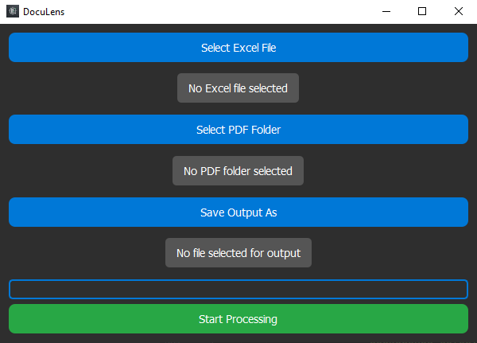

# DocuLens: Automated Policy Documents Analysis Tool

## Features
- **Batch PDF Processing**: Analyze multiple PDF files in one go.
- **Custom Word List**: Provide a custom list of words via an Excel file.
- **Detailed Reporting**: Save results to an Excel file with word counts, means, and totals.
- **Interactive GUI**: User-friendly interface built with PyQt5 for file selection and progress tracking.

## Use Cases
- Policy analysis for academic research.
- Text mining in PDF documents.
- Keyword frequency analysis in large document sets.

---

## Installation

### Prerequisites
Ensure you have the following installed:
- Python 3.7 or higher
- `pip` (Python package manager)

### Required Python Libraries
Install the required dependencies using:
```bash
pip install -r requirements.txt
```

Dependencies include:
- `PyQt5`: For creating the GUI.
- `openpyxl`: For reading and writing Excel files.
- `PyMuPDF (fitz)`: For extracting text from PDFs.

### Cloning the Repository
Clone this repository to your local machine:
```bash
git clone https://github.com/Moonyar/DocuLens.git
cd DocuLens
```

---

## Usage

### Running the Application
Run the application using the following command:
```bash
python DocuLens.py
```

### How to Use
1. **Select Excel File**: Choose an Excel file containing the list of words to analyze. Each word should be in the first column.
2. **Select PDF Folder**: Choose a folder containing the PDF files to analyze.
3. **Save Output File**: Select a location and name for the output Excel file.
4. **Start Processing**: Click the "Start Processing" button. The progress bar will update as the application processes the PDFs.

---

## Input and Output Format

### Input
- **Excel File**: The first column should contain the words to analyze. Additional columns can contain metadata.
- **PDF Files**: Stored in a folder, accessible to the application.

### Output
The application generates an Excel file containing:
- Word counts for each PDF.
- Mean occurrence of each word per document.
- Total occurrences across all PDFs.
- Overall mean frequency.

---

## Example Output
| Word       | PDF1 Count | PDF1 Mean | PDF2 Count | PDF2 Mean | Total | Overall Mean |
|------------|------------|-----------|------------|-----------|-------|--------------|
| policy     | 15         | 0.02      | 12         | 0.01      | 27    | 0.015        |
| governance | 10         | 0.01      | 8          | 0.008     | 18    | 0.009        |

---

## Contributing
Contributions are welcome! If you have suggestions or find a bug, feel free to open an issue or submit a pull request.

### Steps to Contribute
1. Fork the repository.
2. Create a new branch for your feature or bug fix.
3. Commit your changes with a clear message.
4. Submit a pull request for review.

---

## License
This project is licensed under the **Apache License 2.0**. See the [LICENSE](LICENSE) file for details.

---

## Citation
If you use this tool in your research, please cite it as:
```
Sharafi-Laleh, M., & Ganter, S. A. (2024). DocuLens: Automated Policy Documents Analysis Tool. Simon Fraser University. GitHub Repository: https://github.com/Moonyar/DocuLens
```

---

## Authors
- **Mahyar Sharafi-Laleh**
- **Sarah Anne Ganter**

---

## Acknowledgments
Special thanks to the open-source community for providing tools and libraries that made this project possible.

---

## Screenshots
### Main Interface


---

## Contact
For questions or support, please reach out to:
- **Email**: [msa294@sfu.ca]
- **GitHub**: [https://github.com/Moonyar]
